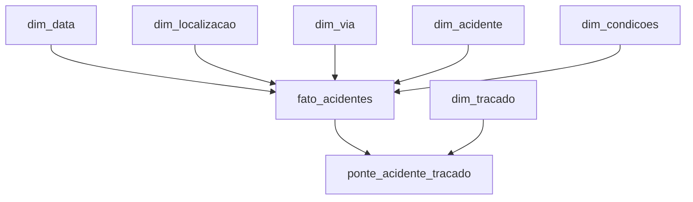

# MVP de Engenharia de Dados — Acidentes em Rodovias Federais (PRF)

## Visão Geral

Este projeto foi desenvolvido como MVP da pós-graduação em Ciência de Dados e Analytics no modulo de Engenharia de Dados.

O trabalho utiliza dados abertos da Polícia Rodoviária Federal (PRF) referentes a acidentes ocorridos em rodovias federais brasileiras entre 2021 e 2025. O objetivo é construir um pipeline de dados em nuvem, desde a ingestão dos arquivos brutos até a criação de uma camada analítica modelada para responder a perguntas de negócio.

A solução foi implementada no **Databricks Free Edition**, utilizando **PySpark**, **Delta Lake** e **Unity Catalog**.

O pipeline segue a organização em camadas:

- **Bronze:** dados brutos consolidados e preservados;
- **Silver:** dados limpos, tipados, padronizados e enriquecidos;
- **Gold:** dados modelados dimensionalmente para consumo analítico.

---

# 1. Problema, Objetivo e Perguntas de Negócio

## 1.1 Problema

O projeto parte da seguinte questão central:

> **Quero entender quais fatores temporais, geográficos, ambientais e rodoviários estão mais associados à ocorrência e à gravidade dos acidentes em rodovias federais brasileiras entre 2021 e 2025.**

A formulação do problema orientou a escolha da base de dados, os campos utilizados, os tratamentos aplicados e a modelagem da camada Gold.

## 1.2 Objetivo Geral

Construir um pipeline de Engenharia de Dados utilizando dados abertos da Polícia Rodoviária Federal, aplicando etapas de ingestão, tratamento, validação de qualidade, modelagem e análise dos acidentes ocorridos nas rodovias federais brasileiras entre 2021 e 2025.

Ao final do processo, os dados devem estar estruturados de forma a permitir a análise das principais características associadas à ocorrência e à gravidade dos acidentes.

## 1.3 Perguntas de Negócio

1. **Como o número de acidentes, feridos e mortos evoluiu entre 2021 e 2025?**
2. **Quais estados, municípios e rodovias concentram mais acidentes e vítimas fatais?**
3. **Como a gravidade dos acidentes varia de acordo com o dia da semana, horário e fase do dia?**
4. **Como condições meteorológicas, tipo de pista e características do traçado da via estão associadas à gravidade dos acidentes?**
5. **Quais causas e tipos de acidente apresentam maior proporção de ocorrências com vítimas fatais?**

---

# 2. Fonte dos Dados

Os dados utilizados são provenientes do **Portal de Dados Abertos da Polícia Rodoviária Federal (PRF)**, mais especificamente da base **BAT — Boletim de Acidente de Trânsito**.

Foram utilizados os arquivos de acidentes **agrupados por ocorrência**, pois nessa estrutura cada registro representa uma ocorrência de acidente, o que é compatível com a granularidade definida para o projeto.

## 2.1 Período analisado

Foram selecionados os anos completos de:

- 2021
- 2022
- 2023
- 2024
- 2025

O ano de 2026 não foi incluído por ainda estar em andamento, evitando comparação entre anos completos e um período parcial.

## 2.2 Arquivos utilizados

| Arquivo | Registros |
|---|---:|
| `datatran2021.csv` | 64.567 |
| `datatran2022.csv` | 64.606 |
| `datatran2023.csv` | 67.766 |
| `datatran2024.csv` | 73.156 |
| `datatran2025.csv` | 72.529 |
| **Total** | **342.624** |

Todos os arquivos apresentaram:

- 30 colunas originais;
- separador `;`;
- codificação Windows-1252 / CP1252;
- mesmo conjunto e mesma ordem de colunas.

## 2.3 Licença e uso dos dados

Os dados fazem parte da política de Dados Abertos da PRF e podem ser utilizados, reutilizados e redistribuídos conforme as condições estabelecidas pelo portal oficial.

Referências:

- Portal de Dados Abertos da PRF
- Dicionário de Dados de Acidentes da PRF

---

# 3. Carga dos Dados

## 3.1 Armazenamento inicial

Os arquivos CSV foram enviados para o Volume:

```text
/Volumes/workspace/default/prf_raw
```

Arquivos:

```text
datatran2021.csv
datatran2022.csv
datatran2023.csv
datatran2024.csv
datatran2025.csv
```

A opção por upload manual foi considerada adequada ao escopo do MVP, pois a fonte já disponibiliza os dados em arquivos CSV prontos para uso.

## 3.2 Leitura inicial

Os arquivos foram lidos com PySpark utilizando:

- cabeçalho;
- separador `;`;
- encoding `windows-1252`.

Na ingestão inicial, os campos foram mantidos como `string`, evitando inferência automática de tipos e preservando a estrutura original.

## 3.3 Validação estrutural

Foi verificado que os cinco arquivos possuíam:

- exatamente 30 colunas;
- os mesmos nomes de colunas;
- a mesma ordem;
- estrutura compatível para união.

Os arquivos foram consolidados com `unionByName`.

Também foram acrescentadas duas colunas de rastreabilidade:

- `ano_arquivo`;
- `arquivo_origem`.

Após a consolidação:

- **342.624 registros**
- **32 colunas**

## 3.4 Camada Bronze

A camada Bronze foi persistida em formato Delta:

```text
workspace.default.prf_acidentes_bronze
```

A Bronze mantém os dados originais da PRF, acrescidos apenas dos campos de rastreabilidade.

---

# 4. Pipeline de Dados

## 4.1 Notebooks

```text
01_ingestao_dados_prf
02_profiling_qualidade_inicial
03_transformacao_silver
04_modelagem_gold
05_analise_dados
```

### `01_ingestao_dados_prf`

- leitura dos CSVs;
- validação estrutural;
- contagem dos registros;
- consolidação dos anos;
- inclusão de rastreabilidade;
- persistência da Bronze.

### `02_profiling_qualidade_inicial`

- completude;
- completude semântica;
- unicidade;
- consistência;
- acurácia;
- análise de categorias;
- investigação de outliers.

### `03_transformacao_silver`

- conversão de tipos;
- padronização de categorias;
- tratamento de ausências;
- atributos derivados;
- tratamento de `tracado_via`;
- persistência da Silver.

### `04_modelagem_gold`

- criação das dimensões;
- criação da tabela fato;
- criação da dimensão de traçado;
- criação da tabela ponte;
- persistência da Gold.

### `05_analise_dados`

- resposta às cinco perguntas de negócio;
- cálculo de indicadores absolutos e proporcionais;
- interpretação dos resultados;
- conclusão geral.

---

# 5. Qualidade dos Dados

A etapa de profiling foi executada antes das transformações.

Foram avaliadas:

- completude;
- consistência;
- unicidade;
- acurácia;
- outliers.

## 5.1 Completude

Não foram encontrados `NULL` ou strings vazias nas 32 colunas da Bronze.

Entretanto, foram encontrados marcadores textuais de ausência:

| Campo | Marcador | Quantidade |
|---|---|---:|
| `condicao_metereologica` | `IGNORADO` | 4.492 |
| `sentido_via` | `NÃO INFORMADO` | 883 |
| `uop` | `N/A` | 267 |
| `delegacia` | `N/A` | 112 |
| `regional` | `NA` | 15 |
| `delegacia` | `NA` | 15 |
| `uop` | `NA` | 15 |
| `regional` | `N/A` | 12 |
| `classificacao_acidente` | `NA` | 5 |

Na Silver, esses valores foram convertidos para `NULL`.

Após a transformação:

| Campo | Nulos |
|---|---:|
| `condicao_metereologica` | 4.492 |
| `sentido_via` | 883 |
| `regional` | 27 |
| `delegacia` | 127 |
| `uop` | 282 |
| `classificacao_acidente` | 5 |

## 5.2 Unicidade

Não foram encontrados:

- IDs duplicados;
- registros completamente duplicados.

A granularidade de uma linha por ocorrência foi preservada.

## 5.3 Datas e horários

Todos os **342.624 registros** da coluna `data_inversa` apresentaram o formato:

```text
yyyy-MM-dd
```

Não foram identificados:

- datas inválidas;
- divergências entre o ano da data e `ano_arquivo`;
- horários inválidos.

## 5.4 Campos geográficos e rodoviários

Foram validados:

- `uf`;
- `br`;
- `km`;
- `latitude`;
- `longitude`.

Não foram identificados problemas relevantes de domínio ou conversão.

## 5.5 Campos numéricos

Foram analisados:

- `pessoas`;
- `mortos`;
- `feridos_leves`;
- `feridos_graves`;
- `ilesos`;
- `ignorados`;
- `feridos`;
- `veiculos`.

Todos puderam ser convertidos para inteiro.

Também foram verificadas regras de consistência lógica, incluindo ausência de valores negativos e compatibilidade entre campos relacionados.

## 5.6 Padronização de `causa_acidente`

Foi identificada a mesma categoria com diferença de capitalização:

```text
Transitar no Acostamento
Transitar no acostamento
```

As duas formas totalizavam **2.080 registros**.

Na Silver, o valor foi padronizado como:

```text
Transitar no Acostamento
```

## 5.7 Investigação de `Colisão lateral`

Foram identificadas:

- `Colisão lateral`;
- `Colisão lateral mesmo sentido`;
- `Colisão lateral sentido oposto`.

A categoria genérica apareceu somente no início de 2021:

- janeiro: 376 registros;
- fevereiro: 300 registros.

Total: **676 registros**.

Como não havia informação suficiente para redistribuir esses registros com segurança, a categoria original foi preservada.

## 5.8 Campo multivalorado `tracado_via`

O campo apresentou **1.214 valores distintos**, pois uma mesma ocorrência pode possuir múltiplas características separadas por `;`.

Foram identificados:

- **67.741 registros** com múltiplas características;
- aproximadamente **19,77% da base**;
- **12 características individuais** após separação.

Entre elas:

- Reta
- Curva
- Declive
- Aclive
- Interseção de Vias
- Rotatória
- Retorno Regulamentado
- Em Obras
- Viaduto
- Ponte
- Desvio Temporário
- Túnel

Na Silver foi criada a coluna:

```text
tracado_via_lista
```

Na Gold, o atributo foi modelado com `dim_tracado` e `ponte_acidente_tracado`.

## 5.9 Outliers

Foram identificados valores extremos, incluindo:

- até 95 pessoas em uma ocorrência;
- até 37 mortos;
- até 131 veículos.

Esses registros foram preservados, pois não havia evidência objetiva suficiente para classificá-los como erros.

---

# 6. Camada Silver

Tabela persistida:

```text
workspace.default.prf_acidentes_silver
```

A Silver manteve os **342.624 registros** da Bronze.

## 6.1 Conversões de tipos

| Campo | Tipo |
|---|---|
| `data_inversa` | `date` |
| `br` | `integer` |
| `km` | `double` |
| `pessoas` | `integer` |
| `mortos` | `integer` |
| `feridos_leves` | `integer` |
| `feridos_graves` | `integer` |
| `ilesos` | `integer` |
| `ignorados` | `integer` |
| `feridos` | `integer` |
| `veiculos` | `integer` |
| `latitude` | `double` |
| `longitude` | `double` |

## 6.2 Atributos derivados

| Campo | Descrição |
|---|---|
| `ano` | Ano da ocorrência |
| `mes` | Mês da ocorrência |
| `hora` | Hora extraída do horário |
| `fim_de_semana` | 1 para sábado/domingo e 0 para os demais dias |
| `acidente_fatal` | 1 quando `mortos > 0`, 0 caso contrário |
| `tracado_via_lista` | Lista de características de `tracado_via` |

---

# 7. Modelagem e Catálogo de Dados

A camada Gold foi estruturada utilizando modelagem dimensional.

A granularidade da tabela fato é:

> **1 linha = 1 ocorrência de acidente.**

## 7.1 Modelo da camada Gold



## 7.2 Tabelas da camada Gold

```text
fato_acidentes
dim_data
dim_localizacao
dim_via
dim_acidente
dim_condicoes
dim_tracado
ponte_acidente_tracado
```

## 7.3 Tabela fato

### `fato_acidentes`

| Campo | Tipo | Descrição | Domínio / Regra | Linhagem |
|---|---|---|---|---|
| `id_acidente` | string | Identificador único | Único | PRF → Bronze → Silver |
| `id_data` | int | FK temporal | `dim_data` | Gold |
| `id_localizacao` | int | FK geográfica | `dim_localizacao` | Gold |
| `id_via` | int | FK rodoviária | `dim_via` | Gold |
| `id_acidente_dim` | int | FK de acidente | `dim_acidente` | Gold |
| `id_condicoes` | int | FK ambiental | `dim_condicoes` | Gold |
| `pessoas` | int | Pessoas registradas | >= 0 | PRF → Silver |
| `mortos` | int | Mortos | >= 0 | PRF → Silver |
| `feridos_leves` | int | Feridos leves | >= 0 | PRF → Silver |
| `feridos_graves` | int | Feridos graves | >= 0 | PRF → Silver |
| `feridos` | int | Total de feridos | >= 0 | PRF → Silver |
| `ilesos` | int | Ilesos | >= 0 | PRF → Silver |
| `ignorados` | int | Estado físico ignorado | >= 0 | PRF → Silver |
| `veiculos` | int | Veículos envolvidos | >= 0 | PRF → Silver |
| `acidente_fatal` | int | Indicador fatal | 0 ou 1 | Derivado de `mortos` |
| `ano_arquivo` | int | Ano do arquivo | 2021–2025 | Bronze |
| `arquivo_origem` | string | CSV de origem | `datatranAAAA.csv` | Bronze |

## 7.4 Dimensões

### `dim_data`

- `id_data`
- `data_inversa`
- `ano`
- `mes`
- `dia_semana`
- `hora`
- `fim_de_semana`
- `fase_dia`

### `dim_localizacao`

- `id_localizacao`
- `uf`
- `municipio`
- `latitude`
- `longitude`
- `regional`
- `delegacia`
- `uop`

### `dim_via`

- `id_via`
- `br`
- `km`
- `sentido_via`
- `tipo_pista`
- `uso_solo`

### `dim_acidente`

- `id_acidente_dim`
- `causa_acidente`
- `tipo_acidente`
- `classificacao_acidente`

### `dim_condicoes`

- `id_condicoes`
- `condicao_metereologica`

### `dim_tracado`

- `id_tracado`
- `caracteristica_tracado`

### `ponte_acidente_tracado`

- `id_acidente`
- `id_tracado`

As descrições de tabelas e colunas também foram registradas no Unity Catalog.

---

# 8. Linhagem dos Dados

```text
Portal de Dados Abertos da PRF
        ↓
CSV 2021–2025
        ↓
Volume prf_raw
        ↓
prf_acidentes_bronze
        ↓
Profiling de Qualidade
        ↓
prf_acidentes_silver
        ↓
Modelagem Dimensional
        ↓
fato_acidentes + dimensões + tabela ponte
        ↓
Análises de Negócio
```

---

# 9. Análise das Perguntas de Negócio

## 9.1 Pergunta 1 — Evolução dos acidentes entre 2021 e 2025

**Pergunta:** Como o número de acidentes, feridos e mortos evoluiu entre 2021 e 2025?

| Ano | Acidentes | Feridos | Mortos |
|---|---:|---:|---:|
| 2021 | 64.567 | 71.873 | 5.397 |
| 2022 | 64.606 | 73.065 | 5.441 |
| 2023 | 67.766 | 78.463 | 5.627 |
| 2024 | 73.156 | 84.526 | 6.160 |
| 2025 | 72.529 | 83.550 | 6.043 |

Entre 2021 e 2024 houve crescimento nos três indicadores. Em 2025 ocorreu pequena redução.

Comparando 2021 com 2025:

- acidentes: aproximadamente **+12,3%**
- feridos: aproximadamente **+16,2%**
- mortos: aproximadamente **+12,0%**

O maior nível dos três indicadores ocorreu em 2024.

---

## 9.2 Pergunta 2 — Distribuição geográfica

**Pergunta:** Quais estados, municípios e rodovias concentram mais acidentes e vítimas fatais?

### Unidades Federativas

Minas Gerais apresentou:

- **44.502 acidentes**
- **3.679 mortes**

Santa Catarina registrou 39.849 acidentes e 1.921 mortes.

O Paraná apresentou 37.055 acidentes e 2.901 mortes.

A Bahia apresentou 18.779 acidentes e 2.795 mortes, ganhando maior relevância quando o indicador analisado é fatalidade.

Estados como Mato Grosso e Maranhão aparecem entre os maiores números de mortes mesmo sem figurar entre os dez primeiros em volume de acidentes.

### Municípios

Brasília apresentou os maiores valores entre os municípios analisados:

- **4.948 acidentes**
- **209 mortes**

O ranking por mortes inclui municípios que não aparecem entre os dez primeiros em volume de acidentes, reforçando que concentração de ocorrências e concentração de fatalidades não são equivalentes.

### Rodovias Federais

A BR-101 apresentou o maior número de acidentes:

- **59.370 ocorrências**

A BR-116 apresentou:

- **52.837 ocorrências**

Por mortes, a ordem se inverte:

- BR-116: **3.600 mortes**
- BR-101: **3.414 mortes**

Rodovias como BR-316 e BR-230 também aparecem no ranking de mortes sem estar entre as dez maiores em volume de acidentes.

### Interpretação

Os rankings absolutos de acidentes e mortes devem ser analisados separadamente.

Os resultados não devem ser interpretados diretamente como medidas de risco, pois não foram normalizados por fatores de exposição, como extensão da malha ou fluxo de veículos.

---

## 9.3 Pergunta 3 — Gravidade por período

**Pergunta:** Como a gravidade dos acidentes varia de acordo com o dia da semana, horário e fase do dia?

### Dia da semana

| Dia | Acidentes | Mortos | Acidentes fatais | % acidentes fatais |
|---|---:|---:|---:|---:|
| Domingo | 56.278 | 5.739 | 4.868 | **8,65%** |
| Sábado | 56.111 | 5.308 | 4.538 | **8,09%** |
| Sexta-feira | 53.009 | 4.224 | 3.607 | 6,80% |
| Quinta-feira | 44.343 | 3.381 | 2.977 | 6,71% |
| Segunda-feira | 47.208 | 3.616 | 3.108 | 6,58% |
| Quarta-feira | 43.392 | 3.263 | 2.810 | 6,48% |
| Terça-feira | 42.283 | 3.137 | 2.711 | 6,41% |

Domingo e sábado apresentaram as maiores proporções de acidentes fatais.

### Horário

A maior proporção ocorreu às **3h**, com **12,66%**.

Outros horários de madrugada também apresentaram percentuais elevados:

- 2h: 11,92%
- 4h: 11,68%
- 5h: 10,95%

O maior volume absoluto de acidentes ocorreu às 18h, com 25.569 ocorrências, mas a proporção de acidentes fatais nesse horário foi de 7,80%.

### Fase do dia

| Fase do dia | Acidentes | Mortos | Acidentes fatais | % acidentes fatais |
|---|---:|---:|---:|---:|
| Amanhecer | 16.601 | 2.109 | 1.780 | **10,72%** |
| Plena Noite | 119.581 | 13.747 | 12.006 | **10,04%** |
| Anoitecer | 18.821 | 1.444 | 1.267 | 6,73% |
| Pleno dia | 187.621 | 11.368 | 9.566 | 5,10% |

### Interpretação

A gravidade varia de forma relevante conforme o período da ocorrência.

Os principais padrões foram:

- maior proporção de acidentes fatais nos fins de semana;
- maior gravidade relativa durante a madrugada;
- amanhecer e plena noite com proporções aproximadamente duas vezes superiores ao pleno dia.

Isso mostra que maior volume de acidentes não significa necessariamente maior gravidade relativa.

---

## 9.4 Pergunta 4 — Condições meteorológicas e características da via

**Pergunta:** Como condições meteorológicas, tipo de pista e características do traçado da via estão associadas à gravidade dos acidentes?

### Condição meteorológica

Entre as categorias com volume relevante:

- Nevoeiro/Neblina: **11,70%**
- Céu Claro: 7,44%
- Nublado: 7,09%
- Chuva: 6,41%
- Garoa/Chuvisco: 5,75%
- Sol: 5,63%

A categoria `NULL` apresentou 10,00%, mas representa ausência de informação e não deve ser interpretada como condição meteorológica.

Categorias com poucos registros, como Neve e Granizo, devem ser interpretadas com cautela.

### Tipo de pista

Pistas simples:

- 167.198 acidentes
- 19.854 mortes
- **9,84% de acidentes fatais**

Pistas duplas:

- **4,77%**

Pistas múltiplas:

- **4,13%**

No conjunto analisado, pistas simples apresentaram proporção de acidentes fatais aproximadamente duas vezes superior às pistas duplas e múltiplas.

### Características do traçado

Maiores proporções:

- Ponte: **10,28%**
- Declive: **9,81%**
- Aclive: **8,89%**
- Curva: **8,12%**
- Reta: **7,40%**

Menores proporções:

- Rotatória: 2,26%
- Retorno Regulamentado: 3,21%
- Interseção de Vias: 3,53%

Como `tracado_via` é multivalorado, uma ocorrência pode aparecer em mais de uma categoria.

### Interpretação

Os resultados indicam associação entre determinadas condições ambientais e características da via e maior gravidade das ocorrências.

A análise é descritiva e não permite estabelecer causalidade.

---

## 9.5 Pergunta 5 — Causas e tipos de acidente com maior proporção de ocorrências fatais

**Pergunta:** Quais causas e tipos de acidente apresentam maior proporção de ocorrências com vítimas fatais?

Para reduzir interpretações baseadas em categorias raras, também foi considerada uma visão com pelo menos 100 ocorrências.

### Causas

Destaques:

- `Suicídio (presumido)`: **50,91%**
- `Pedestre andava na pista`: **42,12%**
- `Entrada inopinada do pedestre`: **29,89%**
- `Transitar na contramão`: **29,12%**
- `Pedestre cruzava a pista fora da faixa`: **25,74%**
- `Área urbana sem a presença de local apropriado para a travessia de pedestres`: **19,28%**
- `Ultrapassagem Indevida`: **16,78%**
- `Pedestre - Ingestão de álcool/ substâncias psicoativas`: **16,10%**
- `Ingestão de álcool ou de substâncias psicoativas pelo pedestre`: **16,07%**
- `Iluminação deficiente`: **15,76%**

Algumas causas muito frequentes apresentaram proporções menores. Por exemplo:

- `Reação tardia ou ineficiente do condutor`: 46.901 acidentes e 5,26% fatais.

### Tipos de acidente

- `Colisão frontal`: **29,29%**
- `Atropelamento de Pedestre`: **29,04%**
- `Colisão lateral sentido oposto`: **8,60%**
- `Eventos atípicos`: **7,11%**
- `Atropelamento de Animal`: **6,36%**
- `Saída de leito carroçável`: **5,74%**
- `Colisão com objeto`: **5,15%**

A `Colisão traseira`, apesar de possuir 65.634 ocorrências, apresentou 4,18% de acidentes fatais.

O tipo `Incêndio` apresentou 7.430 ocorrências e 0,07% de acidentes fatais.

### Interpretação

As maiores proporções de fatalidade aparecem em situações envolvendo pedestres, circulação na contramão e ultrapassagens indevidas.

Entre os tipos de acidente, colisões frontais e atropelamentos de pedestres se destacam com ampla diferença.

---

# 10. Conclusão Geral das Perguntas de Negócio

A análise dos acidentes registrados pela Polícia Rodoviária Federal entre 2021 e 2025 permitiu identificar padrões temporais, geográficos, ambientais e rodoviários associados à ocorrência e à gravidade dos acidentes nas rodovias federais brasileiras.

Em relação à evolução temporal, os dados mostraram crescimento no número de acidentes, feridos e mortos entre 2021 e 2024, seguido por pequena redução em 2025. O ano de 2024 apresentou os maiores valores dos três indicadores no período analisado.

Na distribuição geográfica, observou-se que os locais com maior número de acidentes não são necessariamente aqueles com maior número de mortes. O mesmo comportamento foi observado em estados, municípios e rodovias.

A análise temporal revelou maior proporção de acidentes fatais nos fins de semana, durante a madrugada e nos períodos de amanhecer e plena noite.

As condições ambientais e características da via também apresentaram associação com a gravidade. Nevoeiro/neblina se destacou entre as condições meteorológicas, pistas simples apresentaram proporção de acidentes fatais superior às pistas duplas e múltiplas, e algumas características de traçado, como ponte, declive e aclive, apresentaram percentuais mais elevados.

Por fim, situações envolvendo pedestres, circulação na contramão e ultrapassagem indevida apareceram entre as causas com maiores proporções de fatalidade. Entre os tipos de acidente, colisões frontais e atropelamentos de pedestres apresentaram os maiores percentuais.

De forma geral, os resultados mostram que a gravidade dos acidentes não depende apenas da quantidade de ocorrências registradas. Fatores relacionados ao período, localização, condições ambientais, características da via e natureza do acidente apresentam padrões distintos.

O estudo é descritivo e identifica associações presentes nos dados, mas não permite estabelecer relações de causa e efeito.

Ainda assim, o projeto demonstra como um pipeline de Engenharia de Dados bem estruturado pode transformar dados brutos em uma estrutura organizada e adequada para análises de segurança viária.

---

# 11. Evidências

Principais evidências geradas:

```text
01_upload_arquivos_prf.png
02_tabela_bronze_persistida.png
03_completude_semantica.png
04_unicidade_ids.png
05_investigacao_colisao_lateral.png
06_tabelas_bronze_silver.png
07_modelagem_gold_tabelas.png
08_evolucao_acidentes_feridos_mortos.png
09_distribuicao_geografica_acidentes.png
10_condicoes_via_gravidade.png
```

Outras evidências das análises finais podem ser adicionadas ao repositório.

---

# 12. Tecnologias Utilizadas

- Databricks Free Edition
- Apache Spark
- PySpark
- Spark SQL
- Delta Lake
- Unity Catalog
- Git
- GitHub
- Markdown
- Python

---

# 13. Estrutura do Projeto

```text
mvp-prf-acidentes/
│
├── README.md
│
├── notebooks/
│   ├── 01_ingestao_dados_prf
│   ├── 02_profiling_qualidade_inicial
│   ├── 03_transformacao_silver
│   ├── 04_modelagem_gold
│   └── 05_analise_dados
│
├── evidencias/
│
└── documentacao/
```

Os arquivos CSV originais não são disponibilizados no repositório, pois podem ser obtidos diretamente no Portal de Dados Abertos da PRF.

---

# 14. Autoavaliação

O objetivo principal do projeto foi construir um pipeline de Engenharia de Dados utilizando dados abertos da Polícia Rodoviária Federal, desde a ingestão dos arquivos brutos até a criação de uma camada analítica estruturada para responder às perguntas de negócio definidas no início do trabalho.

Considero que o objetivo foi atingido.

O pipeline foi desenvolvido no Databricks utilizando PySpark, Delta Lake e Unity Catalog, seguindo uma organização em camadas Bronze, Silver e Gold.

Na Bronze, os arquivos de 2021 a 2025 foram consolidados e preservados com campos de rastreabilidade.

Na etapa de qualidade, foram realizadas verificações de completude, unicidade, consistência, acurácia e valores extremos.

Na Silver, foram realizadas conversões de tipos, padronização de valores, tratamento de ausências e criação de atributos derivados.

Na Gold, foi desenvolvida uma modelagem dimensional composta por tabela fato, dimensões e uma tabela ponte para representar corretamente o campo multivalorado de traçado da via.

As cinco perguntas de negócio definidas inicialmente puderam ser respondidas a partir da estrutura criada.

Entre os principais aprendizados está a importância de compreender o objetivo analítico antes de construir o pipeline, pois as perguntas de negócio influenciaram diretamente a seleção dos campos, as transformações e a modelagem.

Também foi possível perceber que problemas de qualidade nem sempre aparecem como valores nulos ou erros técnicos. Em diversos casos, foi necessário interpretar semanticamente os dados para identificar situações como `IGNORADO`, `N/A` e categorias inconsistentes.

Uma das principais dificuldades foi a modelagem do campo `tracado_via`, que permite múltiplas características para a mesma ocorrência. Para evitar perda de informação ou duplicação da fato, foi utilizada uma dimensão específica associada a uma tabela ponte.

Outra dificuldade ocorreu na criação dos relacionamentos da tabela fato com dimensões contendo valores nulos. O problema foi resolvido utilizando comparações compatíveis com valores nulos durante os joins.

Como limitação, o trabalho utiliza dados observacionais e análises descritivas. Portanto, os resultados identificam associações, mas não permitem estabelecer relações causais.

Também não foram utilizadas variáveis externas como fluxo de veículos, extensão das rodovias, volume de tráfego ou condições socioeconômicas. Por isso, rankings absolutos não devem ser interpretados diretamente como medidas de risco.

Como evolução futura, o pipeline poderia ser automatizado para ingestão de novos arquivos, incluir controles adicionais de qualidade, incorporar novas fontes e disponibilizar os resultados em dashboards.

De forma geral, o desenvolvimento do MVP permitiu aplicar na prática conceitos de ingestão, tratamento, qualidade, modelagem, linhagem e análise de dados.

---

# 15. Limitações e Trabalhos Futuros

## 15.1 Limitações

- dados observacionais;
- ausência de variáveis de exposição;
- ausência de fontes externas complementares;
- análise predominantemente descritiva;
- ingestão manual dos arquivos;
- possíveis mudanças de classificação da fonte ao longo do período.

## 15.2 Trabalhos futuros

- automatizar a ingestão;
- criar testes automáticos de qualidade;
- incorporar dados de fluxo de veículos;
- incorporar extensão das rodovias;
- enriquecer com informações meteorológicas externas;
- desenvolver dashboards;
- implementar atualização incremental;
- ampliar a análise para novos anos;
- criar métricas de risco normalizadas por exposição.

---

# 16. Referências

- Polícia Rodoviária Federal — Portal de Dados Abertos
- Polícia Rodoviária Federal — Dicionário de Dados de Acidentes
- Databricks
- Apache Spark
- Delta Lake
